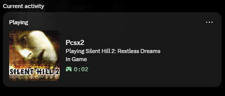
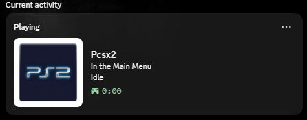

# PCSX2 Discord Rich Presence (Advanced)

<p align="center">
  
</p>

A feature-rich, standalone Discord Rich Presence (RPC) service for the PCSX2 emulator. Designed for modern **PCSX2-Qt** builds and engineered to provide a premium, automated experience that goes far beyond the built-in emulator features.

## 📸 Previews

| Playing a Game | Idle / Main Menu |
| :---: | :---: |
|  |  |

## 🚀 Key Features

*   **Automated Cover Art**: Automatically fetches high-quality game covers from **IGDB** based on game title or serial.
*   **Deep Metadata**: Displays game release years and adds "View on IGDB" buttons directly to your Discord profile.
*   **Modern Qt Engine**: Specifically built to handle modern PCSX2-Qt versions that lack traditional log-based serial reporting.
*   **Compound State Tracking**: Zero-stale updates. Unlike other tools, this accurately detects game swaps even when serials are missing (e.g., transitioning between two "Unknown" titles).
*   **Smart "Idle" Detection**: Cleanly transitions to "In the Main Menu" when you return to the emulator, instead of freezing on the last played game.
*   **Offline Fallback**: Supports local XML databases (GameTDB) if you prefer to stay offline.

## 🆚 Why use this over the built-in PCSX2 Presence?

| Feature | Built-in PCSX2 RPC | This Tool |
| :--- | :---: | :---: |
| **Cover Art** | Manual / Static | **Fully Automatic (IGDB)** |
| **Game Details** | Minimal (Title only) | **Detailed (Year, IGDB Link, etc.)** |
| **Reliability** | Can freeze on game swap | **Compound (Serial + Title) tracking** |
| **Customization** | Hardcoded | **Full YAML/JSON Config** |
| **Qt Support** | Basic | **Engineered for modern builds** |

## 🛠️ Installation & Setup

### 1. Requirements
*   **Discord Desktop Client** (running)
*   **PCSX2** (Qt or regular builds)

### 2. Quick Start (Releases)
1.  Download the latest [Releas Zip](https://github.com/SPIN0ZAi/Pcsx2-Rich-Presence-for-Discord/releases).
2.  Extract it into your PCSX2 folder (or anywhere you like).
3.  Run `Launch-PCSX2.bat` (this will launch BOTH the presence tool and the emulator).

### 3. Configuration
On the first run, a setup wizard will appear to help you configure your:
*   **Discord Application ID** (Create one at [Discord Developers](https://discord.com/developers/applications))
*   **IGDB API Keys** (Optional but highly recommended for cover art)

## ⚙️ Advanced Configuration

Edit `config.yaml` to customize your experience:
```yaml
presence:
  privacy_mode: false         # Hide game titles if you're shy
  show_cover_art: true        # Automatic cover art from IGDB
  show_elapsed_time: true     # Show how long you've been playing
  custom_details: null        # Override "Playing <Game>" text
```

## 🏗️ Development

If you want to run from source:
1.  Clone the repo: `git clone https://github.com/SPIN0ZAi/Pcsx2-Rich-Presence-for-Discord.git`
2.  Install dependencies: `pip install -r requirements.txt`
3.  Run: `python main.py`

## 📄 License
MIT License. Feel free to fork and improve!
